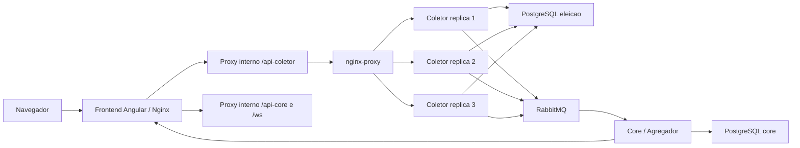

# Voto Distribuido

Sistema de votacao distribuida desenvolvido para fins avaliativos e de testes na disciplina de **Sistemas Distribuidos** da **Universidade Federal de Vicosa (UFV)**.

O objetivo do projeto e demonstrar, em um cenario simples de eleicao, como componentes independentes podem cooperar em uma arquitetura distribuida. O sistema separa a entrada de votos, a agregacao dos resultados, a comunicacao assincrona, a persistencia e a interface web.

> Este repositorio e academico. Ele nao deve ser usado como sistema eleitoral real, nem como referencia final de seguranca para ambientes de producao.

## Sumario

- [Conceitos demonstrados](#conceitos-demonstrados)
- [Arquitetura](#arquitetura)
- [Tecnologias](#tecnologias)
- [Pre-requisitos](#pre-requisitos)
- [Como replicar com Docker](#como-replicar-com-docker)
- [Como validar a execucao](#como-validar-a-execucao)
- [Como executar os testes](#como-executar-os-testes)
- [Fluxo de demonstracao](#fluxo-de-demonstracao)
- [Configuracao e portas](#configuracao-e-portas)
- [Seguranca e dados sensiveis](#seguranca-e-dados-sensiveis)
- [Estrutura do repositorio](#estrutura-do-repositorio)

## Conceitos demonstrados

### Separacao de responsabilidades

O sistema e dividido em servicos com papeis diferentes:

- `frontend`: interface web usada pelo usuario.
- `backend`: servico coletor, responsavel por cadastro, autenticacao e recebimento de votos.
- `core`: servico agregador, responsavel por consolidar votos e publicar resultados.
- `rabbitmq`: broker de mensagens entre coletor e agregador.
- `postgres_core` e `postgres_eleicao`: bancos separados para estados diferentes do sistema.

Essa separacao permite discutir acoplamento, isolamento, escalabilidade e manutencao de componentes distribuidos.

### Replicacao e balanceamento

O servico coletor pode ser executado com multiplas replicas:

```bash
docker compose up -d --build --scale coletor=3
```

As chamadas para o coletor passam por um proxy Nginx, que distribui as requisicoes entre as replicas disponiveis. Isso simula uma camada de balanceamento de carga.

### Comunicacao assincrona

Quando um voto e recebido pelo coletor, ele nao atualiza diretamente o resultado final. O voto e publicado em uma fila RabbitMQ. O agregador consome essa mensagem e atualiza os totais.

Esse desenho reduz o acoplamento direto entre os servicos e permite observar conceitos como fila, produtor, consumidor, atraso de processamento e tolerancia parcial a falhas.

### Persistencia distribuida

O projeto usa dois bancos PostgreSQL:

- banco do coletor, com usuarios e dados de autenticacao;
- banco do agregador, com candidatos, cidades, mensagens e totalizacao.

Essa separacao ajuda a representar a ideia de que diferentes servicos podem ser donos de seus proprios dados.

### Atualizacao em tempo real

O agregador envia atualizacoes para o frontend usando WebSocket/SockJS. Assim, a interface pode refletir mudancas de resultado sem depender apenas de recarregamento manual.

## Arquitetura



Mais detalhes estao em [docs/ARQUITETURA.md](docs/ARQUITETURA.md).

## Tecnologias

- Java 21
- Spring Boot
- Angular
- TypeScript
- Nginx
- RabbitMQ
- PostgreSQL
- Docker e Docker Compose
- Maven
- Karma/Jasmine para testes do frontend

## Pre-requisitos

Para a forma recomendada de execucao:

- Git
- Docker Desktop ou Docker Engine com Docker Compose

Para executar testes fora do Docker:

- Java 21 ou superior
- Node.js 22 ou superior
- npm

## Como replicar com Docker

Clone o repositorio:

```bash
git clone https://github.com/kevennlaranjeira/VotoDistribu-do.git
cd VotoDistribu-do
```

Crie o arquivo local de ambiente:

```bash
cp .env.example .env
```

No Windows PowerShell:

```powershell
Copy-Item .env.example .env
```

Suba toda a stack com tres replicas do coletor:

```bash
docker compose up -d --build --scale coletor=3
```

Verifique os containers:

```bash
docker compose ps
```

Resultado esperado:

- `frontend` em execucao.
- `agregador` em execucao.
- `rabbitmq` saudavel.
- `postgres_core` saudavel.
- `postgres_eleicao` saudavel.
- tres replicas do servico `coletor`.

## Como validar a execucao

Acesse a interface web:

- Frontend: http://localhost:4200

Teste o coletor:

```bash
curl http://localhost:28080/user/healthCheck
```

Resultado esperado:

```text
Vivo
```

Teste o agregador:

```bash
curl http://localhost:28081/eleicao-gp2/listarCandidatosDesc
```

Resultado esperado: uma lista JSON de candidatos.

Teste os proxies internos usados pelo frontend:

```bash
curl http://localhost:4200/api-coletor/user/healthCheck
curl http://localhost:4200/api-core/eleicao-gp2/listarCandidatosDesc
curl http://localhost:4200/ws/info
```

Abra o RabbitMQ Management:

- URL: http://localhost:15672
- usuario padrao de desenvolvimento: `voto_dev`
- senha padrao de desenvolvimento: `voto_dev_password`

## Como executar os testes

Valide a configuracao do Compose:

```bash
docker compose config
```

Execute os testes do coletor:

```bash
cd backend
./mvnw test
```

Execute os testes do agregador:

```bash
cd ../core
./mvnw test
```

No Windows, use:

```powershell
cd backend
.\mvnw.cmd test

cd ..\core
.\mvnw.cmd test
```

Execute build e testes do frontend:

```bash
cd frontend
npm ci
npm run build
npm run test:ci
```

O processo de validacao tambem esta descrito em [docs/TESTES.md](docs/TESTES.md).

## Fluxo de demonstracao

1. Suba a stack com `docker compose up -d --build --scale coletor=3`.
2. Abra `http://localhost:4200`.
3. Crie uma conta ou faca login.
4. Veja a lista de candidatos carregada pelo agregador.
5. Vote em um candidato.
6. Observe a atualizacao dos resultados via WebSocket.
7. Acompanhe as filas no RabbitMQ Management.
8. Observe os logs do agregador:

```bash
docker compose logs -f agregador
```

## Configuracao e portas

As portas locais podem ser alteradas no arquivo `.env`.

| Variavel | Padrao | Uso |
| --- | ---: | --- |
| `FRONTEND_PORT` | `4200` | Interface web |
| `COLETOR_PORT` | `28080` | API do coletor via balanceador |
| `CORE_PORT` | `28081` | API do agregador |
| `RABBITMQ_MANAGEMENT_PORT` | `15672` | Painel web do RabbitMQ |

Outras variaveis importantes:

| Variavel | Uso |
| --- | --- |
| `POSTGRES_USER` | usuario dos bancos de desenvolvimento |
| `POSTGRES_PASSWORD` | senha dos bancos de desenvolvimento |
| `POSTGRES_CORE_DB` | nome do banco do agregador |
| `POSTGRES_ELEICAO_DB` | nome do banco do coletor |
| `RABBITMQ_DEFAULT_USER` | usuario do RabbitMQ |
| `RABBITMQ_DEFAULT_PASS` | senha do RabbitMQ |
| `JWT_SECRET` | chave usada para assinar tokens JWT no coletor |

## Seguranca e dados sensiveis

Este repositorio nao deve conter segredos reais. Os valores em `.env.example` e nos `docker-compose.yml` sao credenciais demonstrativas, publicas e destinadas apenas a execucao local do trabalho.

Antes de qualquer uso fora do contexto avaliativo:

- troque `POSTGRES_PASSWORD`;
- troque `RABBITMQ_DEFAULT_PASS`;
- gere um novo `JWT_SECRET`;
- revise CORS, autenticacao, autorizacao e politicas de persistencia;
- nao publique arquivos `.env`, chaves privadas, certificados ou dumps de banco.

O `.gitignore` ignora `.env`, `.env.*`, chaves privadas e artefatos comuns de build.

## Estrutura do repositorio

```text
.
|-- backend/              # Servico coletor Spring Boot
|-- core/                 # Servico agregador Spring Boot
|-- frontend/             # Aplicacao Angular servida por Nginx
|-- docs/                 # Documentacao complementar
|-- docker-compose.yml    # Stack completa recomendada
|-- .env.example          # Exemplo de configuracao local
|-- .gitattributes        # Configuracao de EOL e GitHub Linguist
`-- README.md             # Guia principal de replicacao
```

## Comandos de limpeza

Parar containers preservando volumes:

```bash
docker compose down
```

Parar containers e remover volumes dos bancos:

```bash
docker compose down -v
```

Remover imagens criadas localmente:

```bash
docker compose down --rmi local
```
