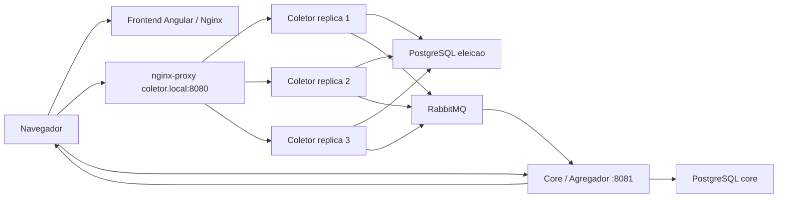

# Arquitetura

## Visao geral

O Voto Distribuido foi organizado em tres aplicacoes e quatro componentes de infraestrutura.

## Componentes

- `frontend`: cliente Angular. Consome `http://localhost:8081` para resultados e WebSocket, e `http://coletor.local:8080` para login, cadastro e voto.
- `backend`: no coletor. Recebe votos autenticados, valida o token JWT e publica mensagens na fila `fila-votos`.
- `core`: no agregador. Consome votos da fila, atualiza totais, mantem candidatos/cidades e publica atualizacoes para o frontend via WebSocket.
- `nginx-proxy`: proxy reverso que balanceia as replicas do coletor pelo host virtual `coletor.local`.
- `rabbitmq`: broker de comunicacao assincrona.
- `postgres_core`: persistencia do agregador.
- `postgres_eleicao`: persistencia do coletor.

## Portas

| Servico | Porta local | Uso |
| --- | ---: | --- |
| Frontend | `4200` | Interface web |
| Coletor via proxy | `8080` | Login, usuarios e votos |
| Core | `8081` | Resultados e WebSocket |
| PostgreSQL core | `5432` | Banco do agregador |
| PostgreSQL eleicao | `5433` | Banco do coletor |
| RabbitMQ | `5672` | AMQP |
| RabbitMQ Management | `15672` | Interface web |

## Filas principais

- `fila-votos`: votos enviados pelo coletor para o agregador.
- `fila-cidades`: mensagens relacionadas a cidades/qualidade do ar.
- `websocket-candidatos-fila`: atualizacao de candidatos para envio ao WebSocket.
- `websocket-cidades-fila`: atualizacao de cidades para envio ao WebSocket.

## Endpoints uteis

- `GET /user/healthCheck` no coletor: teste simples de disponibilidade.
- `POST /user` no coletor: cria usuario e retorna token.
- `POST /user/token` no coletor: autentica usuario e retorna token.
- `POST /eleicao-gp2/votar/{id_candidato}` no coletor: registra voto autenticado.
- `GET /eleicao-gp2/listarCandidatosDesc` no core: lista candidatos por votos.
- `GET /eleicao-gp2/candidatos/{id}/imagem` no core: retorna imagem do candidato.
- `GET /ws` no core: endpoint SockJS/STOMP usado pelo frontend.
